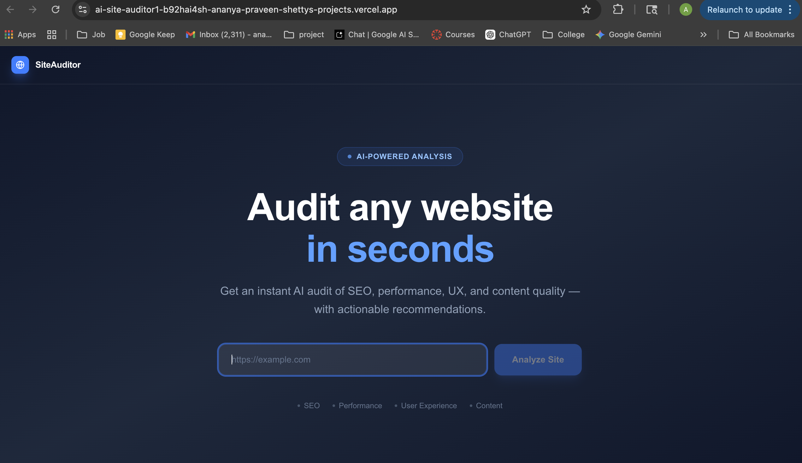
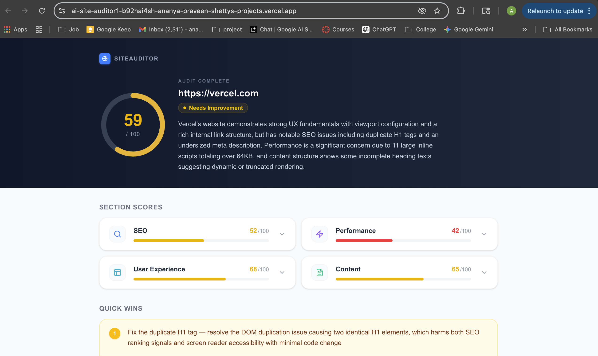
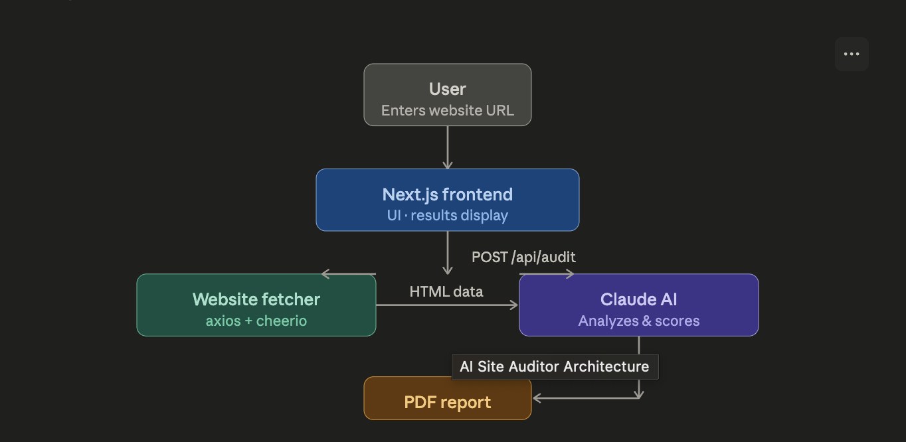
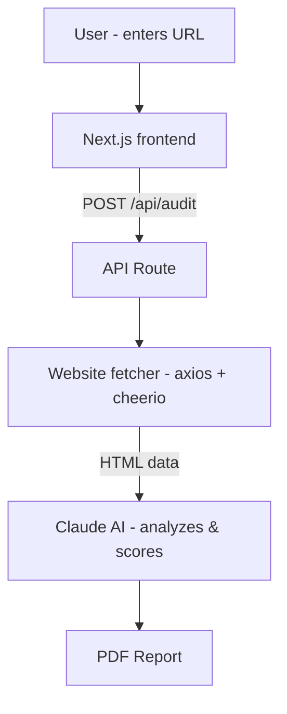

# 🔍 AI Site Auditor

> Paste a URL. Get a full AI-generated website audit in seconds.


---

## 📸 Screenshots

### Enter any website URL


### AI-powered audit results


### Architecture overview


---

## 🚀 What It Does

AI Site Auditor takes any website URL and instantly generates a structured audit report powered by Claude AI. It analyzes the site across four key dimensions and delivers actionable recommendations — all downloadable as a PDF.

**Audit categories:**
- 🔎 **SEO** — meta tags, headings, alt text, link structure
- ⚡ **Performance** — script bloat, image loading, viewport config
- 🎨 **User Experience** — mobile friendliness, navigation, accessibility
- 📝 **Content** — copy quality, structure, engagement

**Output:**
- Scored report (0–100) per category with color-coded indicators
- Issues found + actionable recommendations per section
- Top 3 Quick Wins highlighted for immediate action
- One-click PDF download

---

## 🛠️ Tech Stack

| Layer | Technology |
|---|---|
| Frontend | Next.js 14 (App Router) + TypeScript |
| Styling | Tailwind CSS |
| Site Fetching | Axios + Cheerio |
| AI Analysis | Anthropic Claude claude-sonnet-4-20250514 |
| PDF Generation | jsPDF + jsPDF-AutoTable |

---

## ⚙️ Setup & Run Locally

### 1. Clone the repo
```bash
git clone https://github.com/ananya101001/ai-site-auditor.git
cd ai-site-auditor
```

### 2. Install dependencies
```bash
npm install
```

### 3. Add your Anthropic API key

Create a `.env.local` file in the root:
```
ANTHROPIC_API_KEY=sk-ant-api03-your-key-here
```

Get your key at [console.anthropic.com](https://console.anthropic.com)

### 4. Start the dev server
```bash
npm run dev
```

Open [http://localhost:3000](http://localhost:3000) in your browser.

---

## 🧠 How It Works

1. **User enters a URL** — the frontend sends a POST request to `/api/audit`
2. **Site is fetched** — Axios fetches the raw HTML; Cheerio extracts structured data (title, meta tags, headings, images, links)
3. **Claude analyzes it** — extracted data is sent to Claude AI with a detailed prompt; Claude returns a structured JSON audit
4. **Results rendered** — scores, issues, and recommendations are displayed with expandable cards
5. **PDF export** — jsPDF compiles the full report into a downloadable PDF

---

## 🗂️ Project Structure

```
ai-site-auditor/
├── app/
│   ├── page.tsx              # Main UI (URL input + results display)
│   └── api/
│       └── audit/
│           └── route.ts      # API route (fetch + Claude analysis)
├── lib/
│   └── generatePDF.ts        # PDF generation logic
├── screenshots/
│   ├── add_website.png
│   ├── audit_page.png
│   └── architecture.png
├── sample-output.json        # Example audit output
├── .env.example
└── README.md
```

---

## 📄 Example Output

See [`sample-output.json`](./sample-output.json) for a full example of the audit JSON returned by the API.

```json
{
  "overview": { "score": 72, "summary": "..." },
  "seo":         { "score": 65, "issues": [...], "recommendations": [...] },
  "performance": { "score": 78, "issues": [...], "recommendations": [...] },
  "ux":          { "score": 80, "issues": [...], "recommendations": [...] },
  "content":     { "score": 70, "issues": [...], "recommendations": [...] },
  "quickWins":   ["...", "...", "..."]
}
```

---

## 🏗️ Architecture



---

## 🌐 Live Demo

Deployed on Vercel: **[ai-site-auditor.vercel.app](https://ai-site-auditor1-b92hai4sh-ananya-praveen-shettys-projects.vercel.app/)**

---

## 📬 Contact

Built by **Ananya Shetty** · [GitHub](https://github.com/ananya101001)
